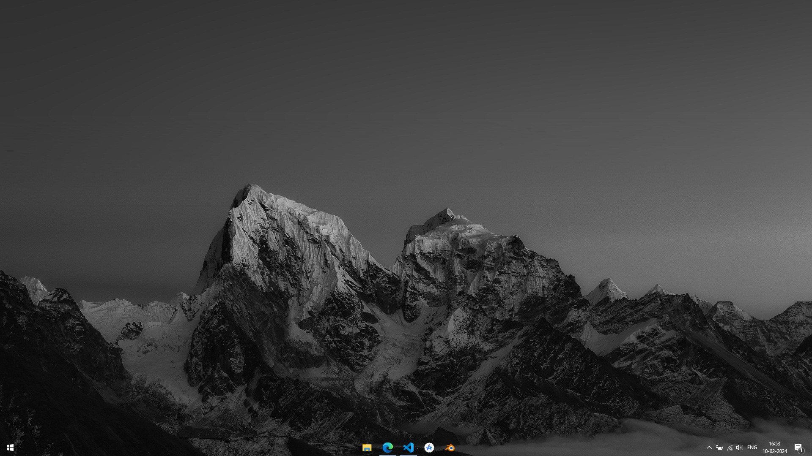

## Transparent Taskbar

A simple batch script to turn your taskbar transparent(not the default windows option, which turns the taskbar translucent). This script will turn your taskbar completely transparent and will then restart your windows explorer, for the taskbar changes to take effect. This you may see your screen flicker once when you execute the script.

After this you can see that your taskbar has turned transparent. If you wish to reverse the process, just execute the script again, and the taskbar will go back to it's original state. You will see your screen flicker everytime you execute the script because the script needs to restart your windows explorer for the taskbar changes to take affect.

#### How to run

You could just *Double Click* the **transparent_taskbar.bat** to execute it.

You could also run the following command in your command prompt to execute it.

> $ absolute_path_to/transparent_taskbar.bat

###### An example how your taskbar would look after running the script.

